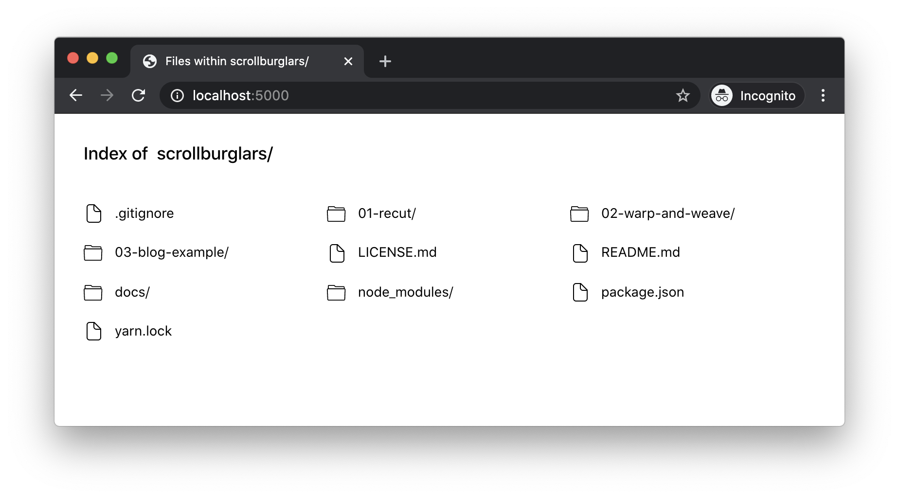
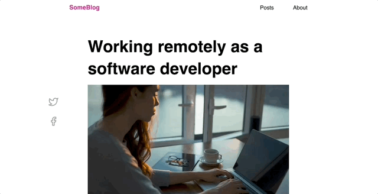

# Scrollburglars Exercise

In this exercise, your goal is to find and fix the scrollburglars across 3 different projects.

## Running the projects

Start by installing NPM dependencies (`npm install`).

Run a local fileserver by running `npm start`.

Visit http://localhost:5001, and you'll see a list of files:

The projects are numbered. Start by clicking "01-recut" to view the first project.

## Solution format

You might be wondering: How do I 'submit' my solution? Where do I apply it?

For these exercises, the goal is to get some practice with the ideas, so it doesn't really matter where you apply your solution. You can add it to the relevant HTML/CSS files, or you can do it right in the browser devtools if you'd prefer.

## Exercise 1: Recut

Recut is software that helps with video editing, created by Dave Ceddia.

Our goal, as with all of these exercises, is to find and fix the scrollburglar, and to do so in a way that makes it less likely for the issue to reoccur.

**NOTE:** This is a Tailwind project, but we aren't running the Tailwind build process. As a result, you won't be able to use Tailwind utilities. Instead, you should write CSS the "typical" way.

## Exercise 2: Warp and Weave

Warp and Weave is an online course that teaches weavers how to use color effectively. It's a wonderful site created by Tien Chiu. It also has a horizontal overflow on mobile. Your goal is to fix it.

This page was built using a site builder, and the markup is a bit of a mess. Feel free to fix this solution in the devtools by adding CSS or deleting superfluous HTML elements.

## Exercise 3: Blog example

I created this third and final example, and it's a tricky one!

Specifically, in addition to removing the horizontal overflow, you must also take care not to break the sticky social icons on desktop:

