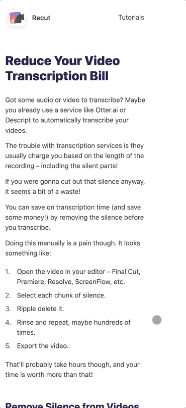
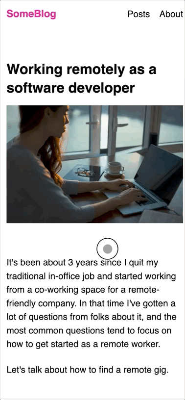

# Scrollburglars Exercise

In this exercise, your goal is to find and fix the scrollburglars across 3 different projects.

## Running the projects

Start by installing NPM dependencies (`npm install` or `yarn install`).

Run a local fileserver by running `npm start` or `yarn start`.

Visit http://localhost:5000, and you'll see a list of files:

The projects are numbered. Start by clicking "01-recut" to view the first project.

## Project 1: Recut

Recut is software that helps with video editing, created by Dave Ceddia.

On mobile screen sizes, it overflows horizontally, causing a scrollburglar:

## Project 2: Warp and Weave

Warp and Weave is an online course that teaches weavers how to use color effectively. It's a wonderful site created by Tien Chiu. It also has a horizontal overflow on mobile:

## Project 3: Blog example

I created this third and final example, and it's a tricky one!

Specifically, in addition to removing the horizontal overflow, you must also take care not to break the sticky social icons on desktop:

